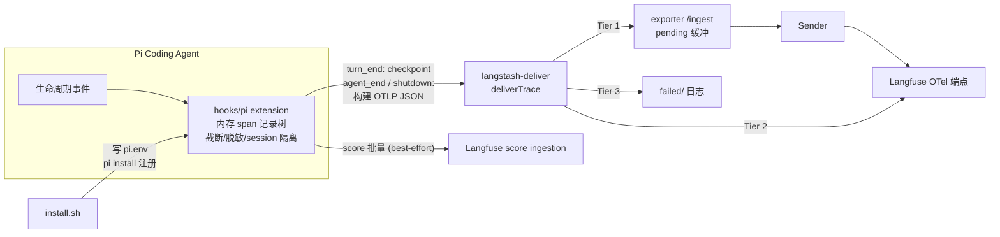

# 在 agent-exporter-to-langfuse 中支持 Pi Coding Agent 的 trace 投递

## Problem

agent-exporter-to-langfuse 已为 claude-code、qoder、qoderwork、opencode、codex、cursor 提供统一的 trace 采集与投递：各 agent hook 构建 OTLP JSON，经 langstash-deliver 三层投递（本地 exporter 缓冲 → Langfuse OTel 端点直推 → failed 日志），由 exporter Sender 统一转发 Langfuse。Pi Coding Agent 目前不在支持列表中。

独立仓库 pi-langfuse 已实现了对 Pi 的完整 trace 跟踪：作为 Pi extension 监听全部生命周期事件，实时构建「agent 根观测 → turn span → generation / tool 观测」的 Langfuse trace 树，并采集 TTFT、token 用量、成本、错误标记与聚合评分。但它使用 Langfuse SDK（OTel 导出 + REST fallback + score 队列）直连 Langfuse，凭据由自身的 config.json 或交互式 `/langfuse-setup` 管理——与 agent-exporter 的缓冲投递模式和 env 文件配置模式完全不同。

需要决定：以何种架构把 Pi 的 trace 跟踪能力接入 agent-exporter 的投递链路，同时保留 pi-langfuse 已验证的观测建模能力，并使配置、安装、检测、打包与本仓库既有 hook 模式一致。

## Context

已验证的事实（含关键 owner）：

- exporter ingest 契约是 OTLP JSON：`exporter/src/ingestor.py` 的 `validate_otlp()` 校验 resourceSpans/spans 结构、traceId/spanId hex、root span 存在性；token 统计从 `langfuse.observation.usage_details` 属性提取。Sender（`exporter/src/sender.py`）将整行 OTLP JSON POST 到 `{base_url}/api/public/otel/v1/traces`。该契约由既有设计（docs/designs/20260618-otlp-json-unified-delivery.md）确立，`langfuse.*` 属性映射（observation type / input / output / model / usage / metadata / trace name / session.id / user.id / tags）是全仓库 hook 的统一约定。
- 三层投递由共享包 `hooks/langstash-deliver/typescript`（`deliverTrace(otlpJson)`）封装，凭据与开关全部来自环境变量（`LANGSTASH_ENABLED/URL/TIMEOUT`、`LANGFUSE_BASE_URL/PUBLIC_KEY/SECRET_KEY`）。hook 自身不持有凭据逻辑。
- 既有 hook 配置模式：install.sh 交互采集凭据写入 `~/.agent-exporter-to-langfuse/config/<agent>.env`；hook 启动时读取该 env 文件作为 process.env 兜底（opencode hook 已如此实现）。
- 新增 agent 的注册面：`exporter/src/hook_state.py` 的 `_builtin_agent_definitions()`（检测路径/命令 + hook 标记，支持 fileCheck 文件存在性检测）、`deploy/installer.sh` 的 `is_agent_installed()`、`deploy/package.sh` 的预构建步骤。WebUI/Menubar 无硬编码 source 列表，读 hook-state.json。
- pi-langfuse 的观测能力（`index.ts` + `src/handlers/*`）：一次 agent run = 一条 `pi-agent` trace；generation 携带 model、modelParameters、usageDetails、costDetails、TTFT（completionStartTime）、finishReason、错误 level；tool 观测按 `toolCallId` 关联、记录时长与 isError；turn_end 无正常 generation 时合成 fallback generation；session_shutdown/中断时关闭悬挂观测并标记 cancelled；`src/state.ts` 用 AsyncLocalStorage 做多 session 隔离；`src/utils.ts`/`redaction.ts`/`limits.ts`/`capture-policy.ts` 提供 payload 整形、截断、脱敏与隐私策略。
- pi-langfuse 的评分通道：trace 级聚合评分（tool_call_count、turn_count、total_tool_errors、tool_success_rate、session_had_errors）与 tool 级 tool_is_error 经 Langfuse `/api/public/ingestion` 的 score-create 批量接口单独发送，不在 OTel span 导出路径内。同时这些聚合值已镜像写入根观测的 metadata（`finishAgentRun()`）。exporter 的 ingest/sender 链路只承载 OTLP JSON，无 score 载荷类型。
- Pi 加载 extension 的机制（已实机验证）：包内 `package.json` 的 `pi.extensions` 声明入口（直接加载 TypeScript，engines node>=22）；extension 包的注册来源是 `~/.pi/agent/settings.json` 的 `packages` 字符串数组，条目既可以是 `npm:<包名>`，也可以是本地目录路径（本机已存在本地路径条目）。`pi install <source>` 将来源写入 settings，`pi remove <source>` 反注册，`pi list` 列出已注册包及其解析路径。
- 仓库不变式（AGENTS.md）：唯一后端是 Langfuse，优先使用 Langfuse 原生概念；hooks 依赖的共享包必须由 install.sh 一并拷贝或在构建时内联（codex 已用 tsdown 内联）；install/uninstall 必须幂等。

推断与未知：Pi 进程被强制终止（crash/kill）时不会触发 `session_shutdown` 事件，事件驱动的内存状态会随进程丢失——这是所有仅依赖 Pi 事件的方案共同面对的边界。

## Goals

- Pi 的每次 agent 运行产生一条完整 trace，经与其他 agent 一致的三层投递进入 exporter 缓冲并最终送达 Langfuse。
- 保留 pi-langfuse 已有的 trace 跟踪能力：agent/turn/generation/tool 观测层级、TTFT、usage/cost、模型元数据、错误标记、悬挂观测收尾、多 session 隔离、payload 截断与脱敏。
- 配置与安装收敛到 agent-exporter 既有模式：env 文件承载凭据与开关、install.sh 幂等安装、hook 状态可被 exporter 检测、纳入统一打包与升级。

## Non-Goals

- 不修改 pi-langfuse 上游仓库与其 npm 包；它作为独立的直连方案继续存在。
- 不为 exporter 的 ingest/sender/存储链路新增 Langfuse score 载荷类型；score 的保留方式见 Recommendation 中的评分通道设计。
- 不改变 exporter 现有的 OTLP JSON ingest 契约、pending/failed 存储结构与 Sender 转发机制。

## Options

### Option A: 移植为 OTLP 构建型 hook，经 langstash-deliver 投递（推荐）

在本仓库新建 Pi hook：复用 pi-langfuse 的事件监听、观测状态机、session 隔离与 payload 整形逻辑，但把「Langfuse SDK 实时观测对象」替换为「内存中的 span 记录树」；agent 运行期间累积 span 记录，`agent_end` 时构建一条完整 OTLP JSON trace 调用 `deliverTrace()`。凭据与开关全部来自 exporter 的 env 文件模式，hook 不再有自己的 config.json 与交互式配置。决定性优势：与本仓库全部既有 hook 的数据契约、配置模式、依赖方向（已刻意移除 Langfuse SDK）完全一致，exporter 的校验、token 统计、缓冲重放、失败恢复能力直接生效，hook 零 Langfuse SDK 依赖。代价：trace 在 agent 运行结束时一次性发出，而非 SDK 的运行中流式导出（见 Recommendation 中的中断处理）。

### Option B: 保留 Langfuse SDK 直连，exporter 增加 OTel 兼容端点

保持 pi-langfuse 的 SDK 运行时不变，仅把 `baseUrl` 指向本地 exporter，由 exporter 新增 `/api/public/otel/v1/traces` 兼容端点接收 SDK 导出。不推荐的决定性原因：exporter 需要伪装成 Langfuse 服务端（OTel 端点之外，SDK 的 trace 可见性轮询 `/api/public/traces/{id}`、REST fallback 与 score 的 `/api/public/ingestion` 都会打到 exporter），要么大面积模拟 Langfuse API，要么这些路径全部静默失效；同时 hook 保留重量级 Langfuse SDK/OTel 依赖，与本仓库已确立的「hook 只构建 OTLP JSON、零 SDK 依赖」方向相反，还引入第二套凭据持有点。

## Recommendation

选择 Option A：在 agent-exporter-to-langfuse 内新建 `hooks/pi/`，以 pi-langfuse 的处理器逻辑为蓝本，重写为「事件驱动累积 + 一次性 OTLP JSON 投递」的 Pi extension，接入既有三层投递链。核心理由：以最小的新机制复用两侧已验证的能力——pi-langfuse 的观测建模照搬语义，exporter 的投递、缓冲、配置、检测、打包全部按既有契约直接生效。

**观测模型与投递（owner：`hooks/pi/` 新 hook）**。一次 Pi agent run 对应一条 trace：root span 承载 agent 观测（prompt 输入、最终输出、trace 级 name/session.id/user.id/tags/metadata），turn 为子 span，generation 与 tool 为对应 turn 的子 span，属性沿用仓库统一的 `langfuse.*` 映射约定（observation type、input/output、model、usage_details、completion_start_time 等），使 exporter 的 token 统计与 Langfuse 服务端解析无需任何改动。pi-langfuse 的生命周期语义全部保留：TTFT 记录、after_provider_response 的错误标记、toolCallId 关联与工具错误 level、turn_end 的 fallback generation、session_compact 标记 span、AsyncLocalStorage 的多 session 隔离，以及 payload 截断 / 脱敏 / 隐私策略（阈值由环境变量控制，随 env 文件下发）。发射时机：`agent_end` 时构建完整 OTLP JSON 调用 langstash-deliver 的 `deliverTrace()`；session 中断或 shutdown 时若存在未完成 run，先关闭悬挂观测并标记 cancelled，再发射这条部分 trace。针对 Pi 进程被强制终止（crash/kill、无任何事件通知）的场景，hook 在每次 `turn_end` 后将当前 run 的累积观测状态 checkpoint 到 hook 自有的本地文件；由于 root agent 观测在 run 开始（`before_agent_start`/`agent_start`）即已创建，checkpoint 必然包含 root span 记录，重建的部分 trace 天然满足 ingestor 的 root span 校验。`agent_end` 正常发射后清除 checkpoint，extension 下次加载时若发现遗留 checkpoint，则将其重建为标记 cancelled 的部分 trace 补发——使 crash 最多丢失最后一个未完成 turn 的数据，而非整条 trace。SDK 时代的 trace 可见性轮询与 REST fallback 机制随直连路径一起终止，投递失败的兜底改由三层投递的 failed 日志与 exporter 的恢复机制承担（最终 owner：exporter 投递链）。

**评分通道（owner：新 hook）**。pi-langfuse 的评分能力（trace 级 tool_call_count、turn_count、total_tool_errors、tool_success_rate、session_had_errors 与 tool 级 tool_is_error）予以保留，但不进入 exporter 的 OTLP 投递链：exporter 链路只承载 OTLP JSON，为评分开辟第二种缓冲载荷类型需要 ingest/sender/存储三处扩展，收益不成比例。取而代之，hook 在 trace 发射后将 score 批量直接 POST 到 Langfuse 的 score ingestion 接口——所需凭据（LANGFUSE_BASE_URL/PUBLIC_KEY/SECRET_KEY）本就存在于 env 文件（三层投递的 Tier 2 使用同一组），无新增凭据持有点。score 发送是 best-effort：失败时仅记日志丢弃、不缓冲重试，因为这些聚合值同时镜像在根观测 metadata 中（沿用 pi-langfuse 既有行为），可随 trace 恢复分析；该降级语义在 hook README 中明示。scores 的 source of truth 是 Langfuse Scores 面板，metadata 镜像仅作兜底。

**配置模型与互斥保护（owner：`hooks/pi/install.sh` + env 文件）**。凭据与开关收敛到 exporter 模式：install.sh 交互采集（或升级时复用）写入 `~/.agent-exporter-to-langfuse/config/pi.env`（LANGFUSE_BASE_URL/PUBLIC_KEY/SECRET_KEY/USER_ID/TAGS + LANGSTASH_ENABLED/URL），hook 启动时读取该 env 文件兜底注入 process.env（与 opencode hook 相同）。pi-langfuse 的 `~/.pi/agent/pi-langfuse/config.json`、首跑交互式配置与 `/langfuse-setup` 系列命令不进入新 hook——运行时配置的唯一入口是 env 文件，消除双配置源。新 hook 与 npm 版 pi-langfuse 同时启用会对同一 run 产生重复 trace，互斥不只靠文档：install.sh 检查 `~/.pi/agent/settings.json` 的 `packages` 中是否存在 pi-langfuse 注册项（格式已验证为字符串数组），检测到时警告并要求用户确认或先移除后再继续；README 同步说明二选一。

**安装、注册与检测（owner：`hooks/pi/install.sh` + `exporter/src/hook_state.py`）**。hook 构建为单文件 bundle（构建时内联 langstash-deliver，与 codex 的 tsdown 方式一致，规避 Pi 运行时的模块解析与共享包拷贝问题），install.sh 将 bundle 连同声明 `pi.extensions` 入口的 package.json 拷贝到稳定安装目录，并以该目录的绝对路径经 `pi install` 注册到 `~/.pi/agent/settings.json` 的 `packages`（已实机验证的官方机制）；uninstall.sh 经 `pi remove` 反注册并删除文件，两者保持幂等（重复 install 不产生重复 packages 条目）。exporter 侧在 `_builtin_agent_definitions()` 新增 `pi` 条目：agent 检测用 `~/.pi` 路径与 `pi` 命令；hook 状态检测用 settingsPath=`~/.pi/agent/settings.json` + 安装路径的稳定目录标识作为 markers（注册字符串由 install.sh 自己控制，子串匹配可靠，能反映「已注册」而非仅「文件存在」）——刻意不设 fileCheck，避免 bundle 文件残留但未注册时误报 installed。`deploy/installer.sh` 的 `is_agent_installed()` 与 `deploy/package.sh` 的预构建步骤同步纳入 pi hook，使统一安装与版本化升级覆盖 Pi。

**兼容性归属**。pi-langfuse 直连行为不迁移、不终止——它在上游仓库继续独立存在；本设计只新增一条经 exporter 的投递路径，Pi trace 数据在启用新 hook 后的唯一 source of truth 是 exporter 投递链。本仓库既有组件（ingest 契约、langstash-deliver、其他 hook）行为不变。

## Handoff To `writing-specs`
- review_route: `separate-design-review`
